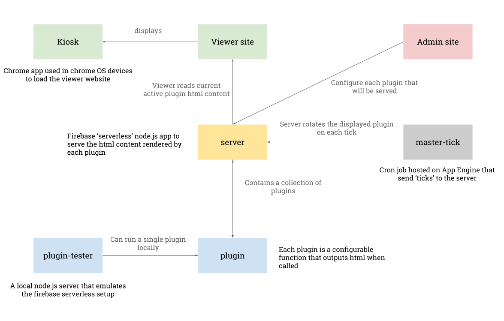

# 🛑 THIS REPOSITORY IS OFFICIALLY NO LONGER UNDER MAINTENANCE since 14/02/2022 ❤️ 🛑

## About 
Novoda dashboards share 'at a glance' challenges and experiences of our globally distributed colleagues.
Dashboards are viewed in two differents contexts: _Office_ & _Project_.

### Office: Informational, Operational, Cultural
Transparency & community is at the heart of Novoda and our tools must reinforce our values. 
[SMART](https://www.mindtools.com/pages/article/smart-goals.htm) Office screens should:
* Promote our mission of togetherness on a journey of learning and growth
* Link Novoda's digital & physical community
* Ensure awareness of company ceremonies & process
* Share achievements, challenges & goals
* Share organic team building opportunities

### Project: Strategic, operational, analytical
Sharing humanised, simplified and useful information is the best way our teams can be aligned to a project's goal. Our teams care about our contributions and their outcomes and so always want to share in an understanding of the metrics of success.
[SMART](https://www.mindtools.com/pages/article/smart-goals.htm) team screens should:
* Represent the team's overarching mission set by the PO
* Share team specific roadmaps, challenges & goals
* Ensure awareness of team specific ceremonies & processes
* Share organic team building opportunities
* Celebrate standout team contributions

## Project Structure

[kiosk](https://github.com/novoda/dashboards/tree/master/kiosk)

    A chrome app kiosk for use with `chromebit` or other chromeos devices 
    to display the Dashboard Viewer site.

[master-tick](https://github.com/novoda/dashboards/tree/master/master-tick)    

    App engine cron job for scheduling `ticks` to the Dashboard Server.

[plugin-tester](https://github.com/novoda/dashboards/tree/master/plugin-tester)

    Node.js CLI tool to simplify the plugin development process.
    
[plugin](https://github.com/novoda/dashboards/tree/master/plugin)

    A base plugin helper Node.js module. 

[server](https://github.com/novoda/dashboards/tree/master/server)

    A `firebase serverless` server written in Node.js   
    
[site](https://github.com/novoda/dashboards/tree/master/site) 

    The `Admin` and `Viewer` websites written in javascript using react & redux. 
